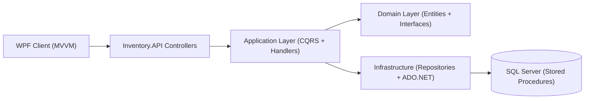
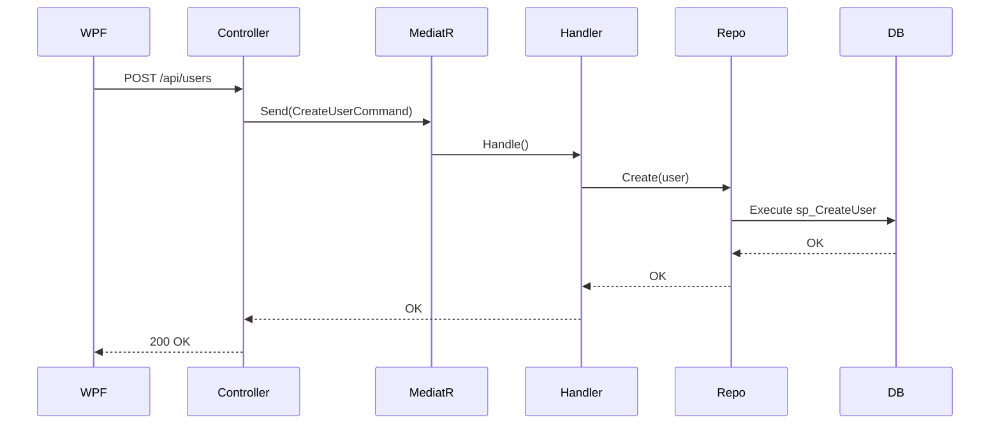
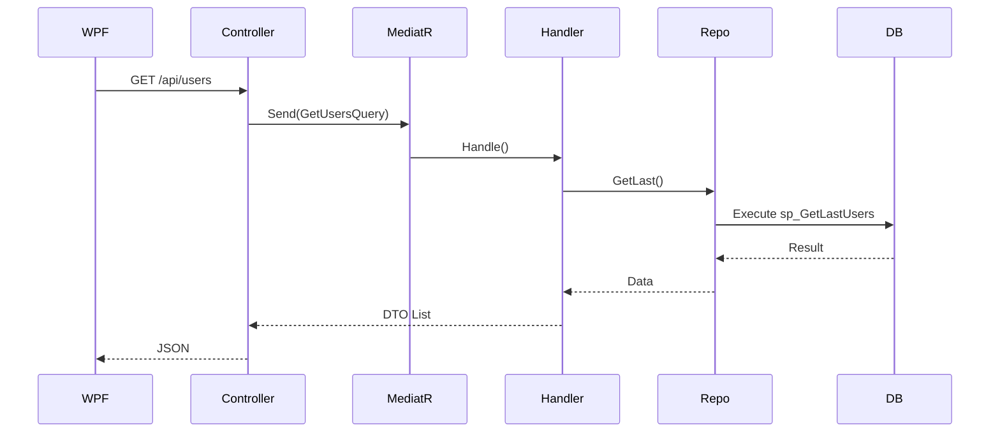

# 🧠 Inventory System

Sistema de gestión de usuarios, áreas, roles y auditoría basado en arquitectura por capas con integración entre:

- API (.NET Core)
- Aplicación (CQRS + MediatR)
- Infraestructura (SQL Server + SP)
- Cliente WPF (MVVM)

---

## 🏗️ Arquitectura del Sistema

---

## 🔁 Flujo CQRS - Command (Crear Usuario)

---

## 🔍 Flujo CQRS - Query (Obtener Usuarios)

---

## 🧩 Tecnologías utilizadas

- .NET Core 8 (API)
- .NET WPF
- MediatR (CQRS)
- SQL Server (Stored Procedures)
- ADO.NET
- WPF + MVVM
- Swagger

---

## ⚙️ Funcionalidades principales

### 👤 Usuarios
- Crear usuario
- Editar usuario
- Eliminación lógica (soft delete)
- Reactivación de usuario
- Validaciones:
  - Nombre sin duplicados (fuzzy)
  - Contacto numérico
  - Email válido
  - Documento único

### 🏢 Áreas y Roles
- Consulta de áreas
- Consulta de roles
- Relación con usuarios

### 📄 Tipo de documento
- Gestión de tipos de documento
- Relación con usuarios

### 🧾 Auditoría
- Registro automático de acciones
- Historial de cambios

---

## 🔁 Flujo general

WPF → API → Application → Domain → Infrastructure → DB

---

## 🚀 Cómo ejecutar el proyecto

### 🔧 1. Base de datos

1. Abrir SQL Server
2. Ejecutar scripts desde:
Inventory.Database

Orden:
1. Tablas  
2. Funciones  
3. Stored Procedures  

---

### 🔧 2. API

Ir a:
Inventory.API

Configurar appsettings.json:

{
  "ConnectionStrings": {
    "DefaultConnection": "Server=.;Database=InventoryDB;User Id=sa;Password=tu_password;"
  }
}

Ejecutar:
dotnet run

Abrir:
http://localhost:xxxx/swagger

---

### 🖥️ 3. WPF

Ir a:
Inventory.WPF

Configurar App.config:

<appSettings>
  <add key="ApiBaseUrl" value="https://localhost:xxxx/api/" />
</appSettings>

Ejecutar proyecto

---

## 🔌 Endpoints principales

### 👤 Users

| Método | Endpoint |
|--------|----------|
| GET    | /api/users |
| POST   | /api/users |
| PUT    | /api/users/{id}/contact |
| DELETE | /api/users/{id} |
| PUT    | /api/users/{id}/activate |

---

### 🏢 Areas

| Método | Endpoint |
|--------|----------|
| GET    | /api/areas |
| POST   | /api/areas |

---

### 🧾 Roles

| Método | Endpoint |
|--------|----------|
| GET    | /api/roles |
| POST   | /api/roles |

---

### 📄 TypeDocuments

| Método | Endpoint |
|--------|----------|
| GET    | /api/type-documents |

---

### 📊 Audit

| Método | Endpoint |
|--------|----------|
| GET    | /api/audit |

---

## 🎯 Soft Delete (Comportamiento)

- IsActive = 1 → Activo  
- IsActive = 0 → Inactivo  

### UI (WPF)
- Fila en gris si está inactivo  
- Botón editar deshabilitado  
- Botón activar visible  

---

## 🧠 Patrones implementados

- CQRS  
- Repository Pattern  
- Dependency Injection  
- MVVM  
- Soft Delete  
- Audit Logging  

---

## ⚠️ Consideraciones

- No hay eliminación física  
- Validaciones en:
  - UI  
  - Backend  
  - Base de datos  
- Uso de Stored Procedures  
